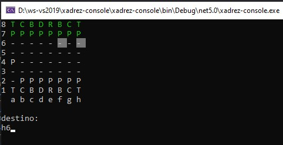

# xadrez-console 
## Jogo de xadrez no console 
**_Jerry Macedo Castro_** | jerry.castro96@outlook.com | linkedin.com/in/jerry-macedo-castro/

## Funcionamento
- A aplicação permite que o usuario joque uma partida de xadrez completa. 
- As jogadas acontecem por meio da escolha da posição de origem e destino da peça a ser movida. Como mostra o exemplo abaixo. 
  > origem: g8 
  > destino: h6
- Ao selecionar a origem são mostradas as possibilidades de destino, bem como jogadas especiais como roque pequeno, roque grande e _en passant_.
- As peças são representadas por sua letra inicial.
  > Exceto a rainha, que é representada pela "D" de dama para evitar confusões com a peça Rei.
- As peças pretas estão representadas na cor verde por conta do fundo do console.

  

## Tecnologias utilizadas
- CSharp
- .NET 5.0

## Iniciando o desenvolvimento
Após clonar o repositório basta abrir o o arquivo _xadrez-console.sln_ no Visual Studio e iniciar o projeto clicando em Ctrl + F5.  
> A versão do Visual Studio utilizada foi a **Community 2019**